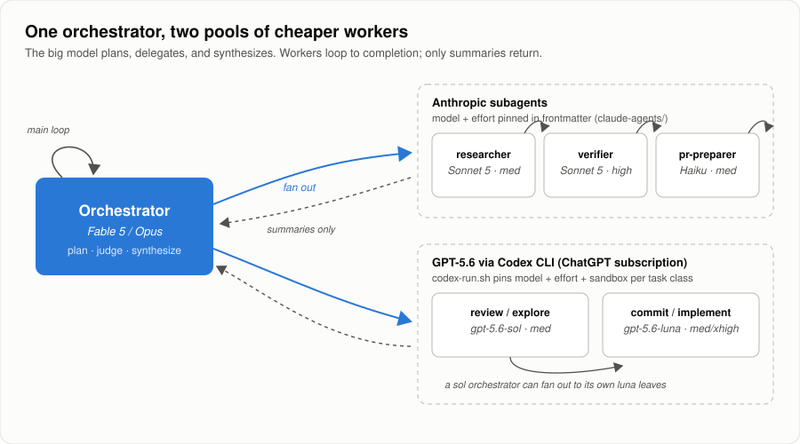
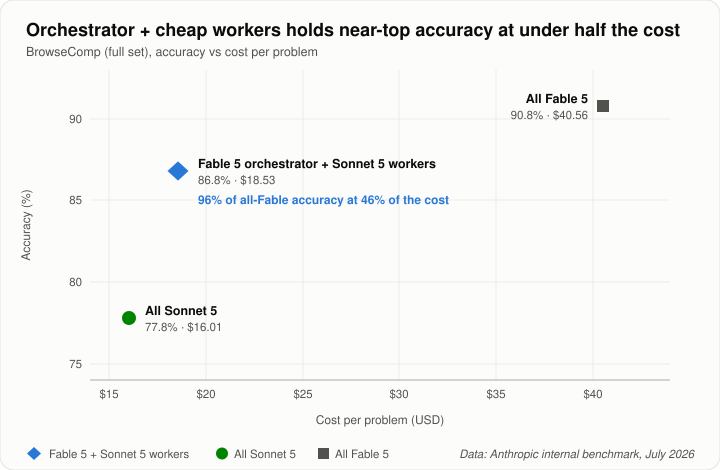

# Cross-Model Agent Delegation

Delegation between [Claude Code](https://code.claude.com) and the [OpenAI Codex CLI](https://developers.openai.com/codex/cli), in **both directions**, with a script owning every flag so the model classifies but never improvises.

This is the setup I run daily as Chief Agent Officer at the Marketing + Media Alliance, extracted and stripped of anything organization-specific. Every claim below was verified against a named CLI version on a stated date, and the failure modes in the "what this cost to get right" sections are ones that actually bit.

- **Claude Code → Codex.** A Fable/Opus orchestrator keeps planning and synthesis; research, review, retrieval, and bulk edits go to Sonnet/Haiku subagents or to Codex workers on GPT-6 Sol (everyday work), GPT-6 Astra (review and the hardest calls), or GPT-6 Luna (mechanical work) at time of writing, resolved from Codex's live model catalog rather than pinned.
- **Codex → Claude Code.** A Codex session sends the same shapes of work the other way, to Haiku/Sonnet/Opus workers.

Two reasons to run it either way:

1. **It cuts expensive-model token burn.** Ad-hoc subagents inherit the session model, so an Opus session burns Opus on grep work unless something pins it. Both wrappers pin it.
2. **It spreads load across two subscriptions.** Claude quota and ChatGPT quota are separate pools, so leaf work crossing the boundary makes both last longer. You also get the cross-family bonus: a GPT model reviewing Claude's work, or a Claude model reviewing GPT's, catches errors two same-family models agree on.

You don't invoke any of this by hand. You talk to whichever CLI you're in; the skill and rules make it classify and route on its own:

- "Fix the flaky retry test" → the fix happens locally, then verification goes cross-family as a `review`-class call.
- "What does our webhook layer actually do?" → an `explore` or `ingest` worker, with only the summary returning to your context.
- "Get a second opinion on this migration plan" → a `review`-class call, framed as feedback, not a bug hunt.
- A 40-file mechanical refactor → fan out to the cheapest tier, synthesize on the orchestrator.



## Why this pattern (the evidence)

This is the **orchestrator-worker pattern Anthropic benchmarked** on the Fable 5 launch: the strong model plans and delegates, cheap workers loop to completion, and most tokens bill at the worker rate. On BrowseComp (full set), Fable 5 orchestrating Sonnet 5 workers scored 86.8% at $18.53/problem vs 90.8% at $40.56 for all-Fable — **96% of the accuracy at 46% of the cost** — while all-Sonnet managed only 77.8%. ([the-decoder coverage](https://the-decoder.com/anthropics-fix-for-fable-5s-high-cost-is-turning-it-into-a-manager-that-delegates-to-sonnet-5/), [pattern guide](https://datasciencedojo.com/blog/claude-code-fable-5-orchestrator-workflow/))



Anthropic also benchmarked the inverse "advisor" pattern (cheap model runs every turn, calls the strong model for guidance): ~92% of Fable's score at ~63% of the price on SWE-bench Pro. The orchestrator split won on both axes, which is why this kit implements the orchestrator pattern and not the advisor. This kit extends the benchmarked setup in two ways: the worker pool spans **two model families** (Sonnet/Haiku and GPT-6), and worker routing is **deterministic** (pinned definitions and a flag-owning script) rather than left to the orchestrator's judgment each spawn.

Everything here was built by fixing real failure modes, each independently verified (July 2026, codex-cli 0.144.1, Claude Code 2.1.x):

- `-c 'mcp_servers={}'` is a **no-op** (TOML table overrides merge), so the popular "disable MCP for speed" advice never worked; the real switch is `--ignore-user-config`.
- Codex's config default model is whatever the desktop app last wrote, so anything relying on it drifts silently.
- Sessions whose parent model uses multi-agent v2 (Astra, Sol, Terra) get spawn tools that **hide** `model`/`reasoning_effort` ([openai/codex#31814](https://github.com/openai/codex/issues/31814)), silently running every subagent on the parent model; two feature flags restore them.
- `codex exec` hangs on piped stdin in background runs; piping its stdout through `tail` silently truncates findings.
- Claude Code subagents default to `model: inherit`, so ad-hoc spawns from an Opus session burn Opus on mechanical work.

## What to install

Install the half that matches the CLI you drive. Most people want one; installing both makes delegation work whichever session they happen to be in.

**In Claude Code** (delegates out to Codex):

```bash
cp -r for-claude-code/skills/delegate-to-codex ~/.claude/skills/
mkdir -p ~/.claude/agents && cp for-claude-code/agents/*.md ~/.claude/agents/   # optional, model-pinned templates
```

**In Codex** (delegates out to Claude Code):

```bash
cp -r for-codex/skills/delegate-to-claude ~/.codex/skills/
mkdir -p ~/.codex/agents && cp for-codex/agents/*.toml ~/.codex/agents/          # optional, Codex fan-out roles
```

**As a plugin marketplace**, which is the version that keeps updating:

```bash
# Claude Code
/plugin marketplace add alectivism/cross-model-agent-delegation

# Codex
codex plugin marketplace add alectivism/cross-model-agent-delegation
```

Requires: both CLIs installed and logged in (`codex login`, `claude auth`), plus `jq` for the guard hooks. Also add the routing rules from [`docs/claude-md-snippet.md`](docs/claude-md-snippet.md) to your `CLAUDE.md`. That's the always-in-context layer that makes delegation happen by default instead of on request.

Each skill loads automatically when a task smells like cross-model delegation ("ask GPT", "get Claude's read", "second opinion", "offload this review"), or when the orchestrator decides on its own that a subtask is worker work. It classifies into one of seven classes (`commit`, `implement`, `explore`, `ingest`, `review`, `hardest`, `prose`) and runs the wrapper, which owns every flag. You never type the invocation yourself, though you can:

```bash
~/.claude/skills/delegate-to-codex/scripts/codex-run.sh review "Here is a plan and its context: ..."
~/.codex/skills/delegate-to-claude/scripts/claude-run.sh  review "Here is a plan and its context: ..."
```

### Optional: hard enforcement hooks

An instruction is a nudge; a hook is a gate. Each side ships a guard that blocks raw CLI calls, with an explicit bypass (`CODEX_RAW=1` / `CLAUDE_RAW=1`). In `~/.claude/settings.json`:

```json
{
  "hooks": {
    "PreToolUse": [{
      "matcher": "Bash",
      "hooks": [{
        "type": "command",
        "command": "~/.claude/skills/delegate-to-codex/scripts/codex-guard.sh",
        "timeout": 10
      }]
    }]
  }
}
```

`for-codex/skills/delegate-to-claude/scripts/claude-guard.sh` is the mirror, reading the same JSON envelope on stdin.

## How the routing works

Same core classes on both sides, so the mental model transfers. Each maps to a model tier, an effort level, and a write posture.

On the Codex side, models are **resolved, not pinned**. `codex-models.sh` reads Codex's own server-fetched catalog (`~/.codex/models_cache.json`, refreshed on every `codex` run) and resolves three tiers by model family, newest generation first: `frontier` (newest Astra), `standard` (newest Sol), and `fast` (newest Luna), each following any server `upgrade` pointer and falling back up a tier if its family disappears. It does not use catalog rank, which is picker order: on 2026-09-22 the catalog listed GPT-6 Sol above GPT-6 Astra. A new GPT release is picked up on the next call with no edit to the kit. `codex-models.sh check` shows the catalog, the resolved tiers, and whether the `for-codex/agents` TOMLs (tagged `# codex-tier:`) have drifted; `sync-agents` rewrites them.

**Claude Code → Codex** (`codex-run.sh`):

| Class | Tier / effort | Sandbox | For |
|---|---|---|---|
| `commit` | fast / low | read-only | commit messages, renames, trivial mechanical |
| `implement` | standard / medium | workspace-write | bounded, specified code changes |
| `explore` | standard / medium | read-only | ambiguous work needing repo exploration or judgment |
| `ingest` | standard / medium | read-only | long-context read-heavy extraction |
| `review` | frontier / medium | read-only | adversarial review, verdicts, architecture |
| `hardest` | frontier / high | read-only | after another class failed, or genuinely hardest; `--escalate` = xhigh, `--effort ultra` adds Codex-side automatic sub-agent delegation |
| `prose` | standard / medium | read-only | readability and copy editing of reader-facing text by a second model |

`--escalate` lifts any standard class to frontier.

**Codex → Claude Code** (`claude-run.sh`):

| Class | Model / effort | Tools | For |
|---|---|---|---|
| `commit` | haiku / low | read-only | commit messages, renames, trivial mechanical |
| `implement` | sonnet / high | write (`acceptEdits`) | small, fully specified code changes |
| `explore` | sonnet / medium | read-only | ambiguous work needing repo exploration or judgment |
| `ingest` | haiku / medium | read-only | long-context read-heavy extraction |
| `review` | sonnet / high | read-only | adversarial review, verdicts, architecture |
| `hardest` | opus / xhigh | read-only | after a cheaper class failed |

`--escalate` moves one rung up (allowed after a failure, or upfront when a wrong verdict triggers something irreversible). `--effort <level>` tunes effort within a class (`low`..`max`, plus `ultra` on models that support it); the model stays tier-resolved. `--model <slug>` pins a slug for one call when you need an A/B. `--priority` (formerly `--fast-tier`) opts into Codex's Fast service tier (2x speed on Astra, 1.5x on Sol and Luna, at 2.5x credits); the wrapper pins `service_tier="default"` otherwise, because the catalog's per-model default is Fast and `--ignore-user-config` would let it through. The design principle: **the LLM only classifies; code owns the flags.** Determinism comes from shrinking the judgment surface to one enum, not from asking the model to remember rules.

`codex-run.sh` also bakes in `--ignore-user-config` (drops ~20 MCP servers and ~50 plugins that otherwise cold-start for minutes), an explicit sandbox, `env -u OPENAI_API_KEY` (forces subscription auth), output to a file instead of stdout, `</dev/null` (background hang fix), and the [#31814](https://github.com/openai/codex/issues/31814) feature flags so a v2-parent orchestrator can actually route cheaper leaves.

`claude-run.sh` bakes in `--strict-mcp-config` and `--disable-slash-commands`, full model IDs rather than aliases, a read-only tool allowlist with no shell, the prompt on stdin, `env -u ANTHROPIC_API_KEY`, and a worker-framing system prompt so the reply comes back as an answer rather than an offer of next steps.

### What the Claude side cost to get right (verified 2026-07-27, Claude Code 2.1.220)

Every one of these was found by running it, not by reading the docs:

- **`--model haiku` silently runs Sonnet 5.** Only `fable`, `opus`, and `sonnet` are documented aliases. `haiku` isn't one, and rather than erroring it falls through to Sonnet, so a haiku-tier call bills at Sonnet with nothing in the output saying so. Proof is in `--output-format json` → `modelUsage`. The wrapper pins `claude-haiku-4-5-20251001`.
- **`--strict-mcp-config` took a fully loaded machine from 123 tools to 29 built-ins.** Those 94 tool schemas load every turn otherwise.
- **`--bare` is a trap.** It looks like the equivalent of Codex's `--ignore-user-config`, but it also forces auth to `ANTHROPIC_API_KEY` or an `apiKeyHelper` and never reads OAuth or the keychain. On a subscription it either fails or quietly bills the API.
- **The prompt must go on stdin.** `--tools`, `--add-dir`, `--allowedTools`, and `--mcp-config` are variadic, so a trailing positional prompt is swallowed as another value. The symptom is `Input must be provided either through stdin or as a prompt argument` when you clearly passed one.
- **Plan mode is the wrong lock for a worker.** `--permission-mode plan` does block writes including through Bash, but it drags the interactive framing along: workers write plan documents into `~/.claude/plans/` and end on "shall I proceed?". Dropping Bash from the allowlist is the stronger lock and the quieter one. Confirmed by asking a `review` worker to overwrite a file: it declines in one line and the file is untouched.
- **There is no `-C`.** The CLI has no working-directory flag; the wrapper `cd`s and passes `--add-dir`.

## Claude-side subagents: how model/effort pinning actually works

Facts current as of Claude Code 2.1.x ([docs](https://code.claude.com/docs/en/sub-agents)):

- Agent frontmatter supports **`model:`** (`sonnet`, `opus`, `haiku`, full ID, or `inherit`) and **`effort:`** (`low`..`max`). Both default to inheriting the session.
- **Model is settable at call time; effort is not.** The Agent tool exposes a per-call `model` override, but no effort parameter — effort only exists in definitions. So an instruction like "scale reasoning effort to difficulty" is unactionable for ad-hoc spawns; the orchestrator has no knob to turn. If you want effort routing, ship named agents with effort presets and instruct by agent name. That asymmetry is why this kit is definitions-first.
- **There is no global "all subagents use X" setting.** Pinning happens per definition (frontmatter) or per call (the `model` parameter on the Agent tool).
- **One-off/undefined subagents and built-in types (`general-purpose`, `Explore`, `Plan`, `fork`) inherit the session model.** An Opus session that spawns an ad-hoc researcher runs it on Opus unless the call passes `model` explicitly. This is the single biggest silent cost leak; the templates in `for-claude-code/agents/` exist to close it.
- **Bake the return format into each definition.** A subagent's report is appended to the main conversation and re-read on every subsequent turn, so a worker that dumps raw output taxes the orchestrator forever after. Every template in `for-claude-code/agents/` specifies what its final message must contain.
- Distribution: user-level (`~/.claude/agents/`), project (`.claude/agents/`), Enterprise **managed subagents** (managed settings directory; override same-named user/project agents), or a **plugin `agents/` directory** — the packaging unit that also reaches Cowork. Org admins can force-install plugins (Organization settings → Plugins, or `managed-settings.json`); note CLI users still install with `/plugin install`, and plugin agents ignore `hooks`, `mcpServers`, and `permissionMode` frontmatter. Skills cannot define agents; they can only reference them.

### The token economics (why this saves money at all)

The orchestrator re-reads its whole conversation every turn, including after each worker returns. Delegation pays because it controls what enters that transcript: a worker burns its tokens in a disposable context and hands back a tight brief, so 50k tokens of search noise become 500 tokens of summary, and prompt caching discounts the re-read of everything older. Two costs to respect: spawning has fixed overhead (system prompt + tool definitions load per worker, and multi-agent sessions run roughly 4-7x the raw tokens of single-agent), so tiny tasks are a net loss inline-able in one call; and nesting beyond two layers usually loses to context blindness — each layer only knows what its parent passed down. Fan out when the work is exploratory and bulky, stay inline when it's small, and stop at orchestrator → worker except when the middle layer genuinely compresses (a researcher fanning out per-source readers).

`for-claude-code/agents/` ships pinned templates: researcher, deep-research, content-writer, bug-investigator, doc-writer, pr-preparer, test-writer, dependency-auditor, adversarial-verifier, and a `_template.md`. The adversarial-verifier pairs with any generator as a generator/verifier split; run the verifier on a different model (or model family, via `codex-run.sh review` or `claude-run.sh review`) than the generator — different models catch different errors.

## For Claude Teams/Enterprise admins (Cowork)

See [`docs/org-instructions-cowork.md`](docs/org-instructions-cowork.md) for a paste-ready organization instruction that propagates a lightweight version of this delegation policy to every member across Chat, Cowork, and Code, plus why an instruction alone isn't sufficient and what the plugin/managed-agent backstop looks like.

## Repo layout

```
for-claude-code/                 install this half into ~/.claude
  skills/delegate-to-codex/        SKILL.md + codex-run.sh + codex-guard.sh
  agents/                          model+effort-pinned Claude agent templates
for-codex/                       install this half into ~/.codex
  skills/delegate-to-claude/       SKILL.md + claude-run.sh + claude-guard.sh
  agents/                          Codex fan-out roles: luna-leaf (fast tier), sol-reviewer, terra-ingest (frontier tier; names are historical, the `# codex-tier:` tag decides)
docs/org-instructions-cowork.md  org instruction for Teams/Enterprise admins
docs/claude-md-snippet.md        routing rules for your CLAUDE.md (always-in-context layer)
```

Skill names read as verbs from the installer's point of view: you install `delegate-to-codex` in Claude Code and `delegate-to-claude` in Codex. The folder says which host, the name says which direction.

## Layered enforcement model

1. **Rules (CLAUDE.md)** — always in context; holds the routing policy. See `docs/claude-md-snippet.md`.
2. **Skill** — loaded on demand; holds the long-form detail and the scripts.
3. **Definitions** — agent frontmatter and TOML roles pin model/effort mechanically.
4. **Hook** — blocks the bypass path entirely.

A model reading a rule is compliance; a script owning the flags is determinism. Use both.

## Design principles

The five rules everything here follows from:

1. The LLM classifies; code owns the flags. Determinism comes from shrinking the judgment surface to one enum.
2. Pin the model in the definition, because the orchestrator forgets and inheritance is silent.
3. Bake the return format into the worker, because its report is re-read on every later turn.
4. Delegate for compression, not for tidiness. If the work is small, inline is cheaper than a spawn.
5. Cross-family review beats same-family review. Two models from one family agree on the same mistakes.

## Caveats

Codex model slugs are resolved from the live catalog, but the fallback constants in `codex-models.sh`, the Claude ID `claude-haiku-4-5-20251001`, and behaviors like #31814 and the silent `haiku` alias fallback are point-in-time; re-verify after either CLI updates. The `codex features list` and `codex mcp list` commands are your friends — and don't trust an LLM's self-report of its own tool schema, ours confidently got it wrong in both directions. Verify with `--json` events or A/B tests.

## License

MIT
